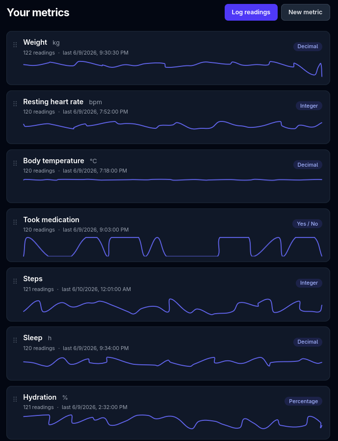

# Malady

**Malady** is a privacy-first, multi-user health-metric tracker. Each person
configures their own set of metrics — temperature, weight, medication, period,
heart rate, anything — logs timestamped readings, and visualises them. Metric
types are fully configurable and can be **changed after data has been entered
without losing the original values**.

Built with Ruby on Rails 8, Hotwire, and Tailwind CSS. Mobile-first, with an
optional dark mode. Licensed under **AGPL-3.0** (see [License](#license)).



---

## Table of contents

- [Background](#background)
- [Overview](#overview)
- [Feature scope](#feature-scope)
- [Tech stack](#tech-stack)
- [Architecture](#architecture)
- [Getting started (development)](#getting-started-development)
- [Running the tests](#running-the-tests)
- [Configuration (environment variables)](#configuration-environment-variables)
- [Admin account](#admin-account)
- [Grafana integration](#grafana-integration)
- [Data export](#data-export)
- [Production & Docker Compose](#production--docker-compose)
- [License](#license)
- [Contributing](#contributing)

---

## Background

A family member has been dealing with a stubborn, hard-to-pin-down malady, and
we'd love to find the patterns hiding in it. Being nerds, our instinct was
obvious: collect the data, then go looking. We wanted something dead simple to
jot readings into throughout the day — at the desk, on the couch, on a phone in
a waiting room — and then sift through later for whatever the numbers are trying
to tell us.

So we went looking for a tool. And looking. Everything was either a walled
garden, a subscription, or quietly shipping our most personal data off to
someone else's cloud. Open source, self-hostable, and private? Crickets. So I
did the reasonable thing and started building one.

Right now it does the basics and not much more — but that's the point. It'll
grow as real life shows us which features actually earn their keep, instead of
the ones we *think* we need. And, full disclosure: most of this is lovingly
vibe-coded.

**Got ideas?** We'd genuinely love to hear them. If you can think of a better way
to track, slice, or visualise this kind of data — or you just want to poke at
the code — open an issue, send a PR, or start a discussion. Contributions,
suggestions, and "have you considered…" comments are all very welcome. See
[Contributing](#contributing) to jump in.

---

## Overview

Malady gives each user a personal dashboard of the health parameters they care
about. A *metric* is a typed column (e.g. "Weight" as a decimal in kg, "Mood" as
an enumeration, "Fasting" as a yes/no). Users record *data points* against each
metric over time. Because real tracking needs evolve, a metric's type can be
changed later: Malady previews exactly how many existing values will convert,
and on apply it re-projects values while always preserving the original input.

All data is strictly scoped to its owner. Visualisation is available either
in-app or through Grafana via a read-only JSON API.

## Feature scope

- **Multi-user accounts** (Devise): sign up, sign in, password reset, email
  confirmation, account lockout. Public sign-ups are gated by an env var.
- **Per-user configurable metrics** with types: `decimal`, `integer`,
  `percentage`, `boolean`, `enumeration`, `text`.
- **Type changes without data loss** — dry-run preview (how many convert / fail,
  with sample failures) then a lossless apply that preserves every original value.
- **Per-metric logging** with live updates via Hotwire / Turbo Streams.
- **Dashboard** with drag-to-reorder metrics.
- **Mobile-first UI** with optional **dark mode**.
- **Data export** as **JSON** and **CSV** (long format).
- **Grafana integration** through a token-authenticated, read-only JSON API.
- **Admin** area to administer user accounts (list, view, lock/unlock, confirm,
  delete), with an env-bootstrapped admin user.
- **Privacy first** — every query is owner-scoped; the API token is read-only.
- **i18n-ready** (English only for now).
- **UTC everywhere** in storage; timestamps are resolved to the viewer's local
  time in the browser.

## Tech stack

- Ruby on Rails 8, Ruby 4.0
- Hotwire (Turbo + Stimulus), Haml templates
- Tailwind CSS v4 (class-based dark mode)
- Devise (authentication)
- **SQLite** for development & test, **PostgreSQL** for production
- Minitest (model, controller/integration, and system tests)
- `letter_opener` (dev email preview), `exception_notification` (prod alerts)

## Architecture

The data model is an EAV (entity-attribute-value) design:

- `Metric` — a typed column owned by a user (`data_type`, `unit`, `enum_options`, …).
- `DataPoint` — one value per metric per timestamp. `value_text` holds the
  **canonical string and is the source of truth**; `value_decimal` / `value_boolean`
  are projections maintained for querying and charting.
- `ValueCaster` — the single source of truth for validating and casting raw input
  per metric type.
- `MetricTypeChanger` — `dry_run` (preview) and `apply!` (re-project from
  `value_text` in a transaction; originals never lost).

This keeps a metric's type change a matter of re-projecting the preserved
`value_text`, so changing `text → decimal` (or back) never destroys data.

## Getting started (development)

Prerequisites: Ruby 4.0.x, Node, and a JS runtime (development uses SQLite, so no
database server is required).

```bash
bundle install
bin/rails db:prepare      # create + migrate + seed (dev/test use SQLite)
bin/dev                   # starts Rails AND the Tailwind CSS watcher (Procfile.dev)
```

> **Important:** use `bin/dev`, not `bin/rails server` alone — `bin/dev` runs the
> Tailwind build/watch process. If you run the server without it, run
> `bin/rails tailwindcss:build` first or styles will be missing/stale.

`bin/rails db:seed` creates a confirmed demo user in development:

- **Email:** `demo@malady.test`
- **Password:** `password123`

Then visit <http://localhost:3000>.

## Running the tests

```bash
bin/rails test          # model, service, controller & integration tests
bin/rails test:system   # Capybara system tests (requires Chrome)
```

The project uses Rails' native Minitest. Tests that sign a user in use the
`confirmed_user` helper in `test/test_helper.rb` (Devise `:confirmable` blocks
unconfirmed users).

## Configuration (environment variables)

All runtime configuration is via environment variables.

### Sign-ups

| Variable | Default | Meaning |
|---|---|---|
| `MALADY_ALLOW_SIGNUPS` | `false` | `true`/`1`/`yes`/`on` allows public sign-up. Any other value (or unset) closes registration (route returns 404 and the sign-up link is hidden). |

### Admin account

| Variable | Meaning |
|---|---|
| `MALADY_ADMIN_EMAIL` | Admin login email |
| `MALADY_ADMIN_PASSWORD` | Admin password (min 6 chars, per Devise) |

See [Admin account](#admin-account).

### Email (ActionMailer)

Development uses **letter_opener** (sent mail opens in the browser; nothing
leaves the machine). Production uses SMTP, fully env-configured:

| Variable | Default | Meaning |
|---|---|---|
| `MALADY_HOST` | `localhost` | Host used in mailer URLs |
| `MALADY_MAILER_SENDER` | `no-reply@malady.local` | Default "from" address |
| `MALADY_SMTP_ADDRESS` | `localhost` | SMTP host |
| `MALADY_SMTP_PORT` | `587` | SMTP port |
| `MALADY_SMTP_USER_NAME` | — | SMTP username |
| `MALADY_SMTP_PASSWORD` | — | SMTP password |
| `MALADY_SMTP_DOMAIN` | `localhost` | HELO domain |
| `MALADY_SMTP_AUTHENTICATION` | `plain` | SMTP auth method |
| `MALADY_SMTP_STARTTLS` | `true` | Enable STARTTLS |

### Exception notifications

| Variable | Meaning |
|---|---|
| `MALADY_EXCEPTION_RECIPIENTS` | Comma-separated emails. When set, uncaught exceptions email these addresses (via `exception_notification`). When unset, the notifier is disabled. |

### Database (production)

| Variable | Default |
|---|---|
| `DATABASE_NAME` | `malady_production` |
| `DATABASE_USER` | `malady` |
| `DATABASE_PASSWORD` | — |
| `DATABASE_HOST` | `localhost` |
| `DATABASE_PORT` | `5432` |

Development and test use SQLite and ignore these.

## Admin account

The admin can administer user accounts at **`/admin/users`** — list, view,
lock/unlock, confirm, and delete users. (An admin cannot lock or delete their
own account, to avoid lockout.)

The admin is **bootstrapped from the environment** and works even when public
sign-ups are closed. Set `MALADY_ADMIN_EMAIL` and `MALADY_ADMIN_PASSWORD`, then:

- **Just start the app** — the admin is auto-provisioned on boot (idempotent), or
- run it explicitly: `bin/rails malady:ensure_admin` (also run by `bin/rails db:seed`).

The env vars are the **source of truth**: each run resets the admin's password to
`MALADY_ADMIN_PASSWORD`. Rotate the password by changing the env var, not the DB.

## Grafana integration

Malady exposes a read-only, token-authenticated JSON API designed for Grafana's
[Infinity datasource](https://grafana.com/grafana/plugins/yesoreyeram-infinity-datasource/):

- `GET /api/v1/metrics` — the token owner's metrics (`slug`, `name`, `data_type`, `unit`)
- `GET /api/v1/metrics/:slug/series?from=&to=` — `[{ "time": <ISO-8601 UTC>, "value": <number> }]`

Authenticate with your personal API token as a Bearer token:

```
Authorization: Bearer <your-token>
```

Find and rotate your token in-app at **`/api_token`** (linked from the dashboard).
The token is read-only and scoped to your own data.

### Grafana via Docker Compose

The `docker-compose.yml` stack includes a **`grafana`** service with the Infinity
datasource plugin pre-installed. Once the stack is up:

1. Open Grafana at <http://localhost:3001> and log in (default `admin` / `admin`,
   set via `GF_SECURITY_ADMIN_*` in `docker-compose.yml`).
2. Add a datasource → **Infinity**.
3. Under the datasource's **Authentication → HTTP headers**, add a header
   `Authorization` with value `Bearer <your-token>` (copy the token from Malady's
   `/api_token` page).
4. In a panel, add an **Infinity** query: type **JSON**, source **URL**,
   URL `http://app:3000/api/v1/metrics/<slug>/series` (use the compose service
   name `app`, not `localhost`), and parse the `time` / `value` fields.

> The plugin is downloaded on Grafana's first start, so that initial boot needs
> internet access.

## Data export

Signed in, you can export all your data:

- **JSON:** `GET /export/json` — metrics with definitions and all data points.
- **CSV:** `GET /export/csv` — long format: `metric_slug, metric_name, recorded_at, value, unit, note`.

All timestamps are UTC ISO-8601.

## Production & Docker Compose

Production uses PostgreSQL. The provided `docker-compose.yml` runs the full stack
— a `db` (PostgreSQL 18) service and an `app` (Malady) service — and the **`app`
service's `environment:` block documents and sets every configuration variable**
(see [Configuration](#configuration-environment-variables) for what each does).

Before first launch, edit `docker-compose.yml` and set at least:

- `SECRET_KEY_BASE` — required in production; generate one with `bin/rails secret`.
- `MALADY_ADMIN_EMAIL` / `MALADY_ADMIN_PASSWORD` — the admin account, auto-provisioned on boot.
- `MALADY_HOST` — the public hostname (used in email links).
- The `MALADY_SMTP_*` values if you want outgoing email in production.

`DATABASE_HOST` is preset to `db` so the app reaches the Postgres container.

```bash
docker compose run --rm app bin/rails db:prepare   # create + migrate (provisions the admin)
docker compose up -d                               # db + app (http://localhost:3000) + grafana (http://localhost:3001)
```

The stack also includes **Grafana** (port 3001) for charting Malady data — see
[Grafana via Docker Compose](#grafana-via-docker-compose).

In **development** (outside Docker), outgoing email is previewed in the browser
via [letter_opener](https://github.com/ryanb/letter_opener) — no SMTP server is
needed. Production sends via SMTP, configured through the `MALADY_SMTP_*` vars.

The admin is auto-provisioned on boot from `MALADY_ADMIN_*`, so once the stack is
up you can sign in at `/users/sign_in` with those credentials.

## License

Malady is free software licensed under the **GNU Affero General Public License,
version 3 (AGPL-3.0)**. See the [LICENSE](LICENSE) file for the full text.

The AGPL's defining clause matters for a hosted app: **if you run a modified
version of Malady as a network service, you must offer its complete corresponding
source code to the users of that service.** Distribution and modification are
otherwise governed by the GPL family's copyleft terms — derivative works must also
be released under the AGPL-3.0.

Copyright (C) the Malady contributors.

## Contributing

Contributions are welcome — see [CONTRIBUTING.md](CONTRIBUTING.md) for the
workflow, coding standards, and testing expectations. By contributing you agree
that your contributions are licensed under the AGPL-3.0.
